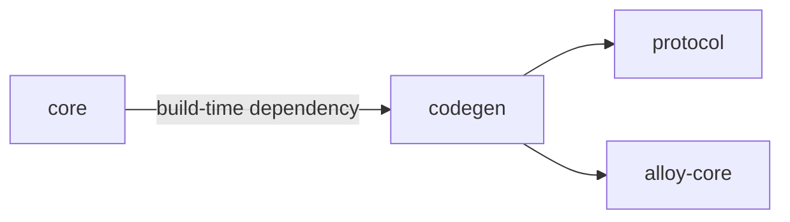
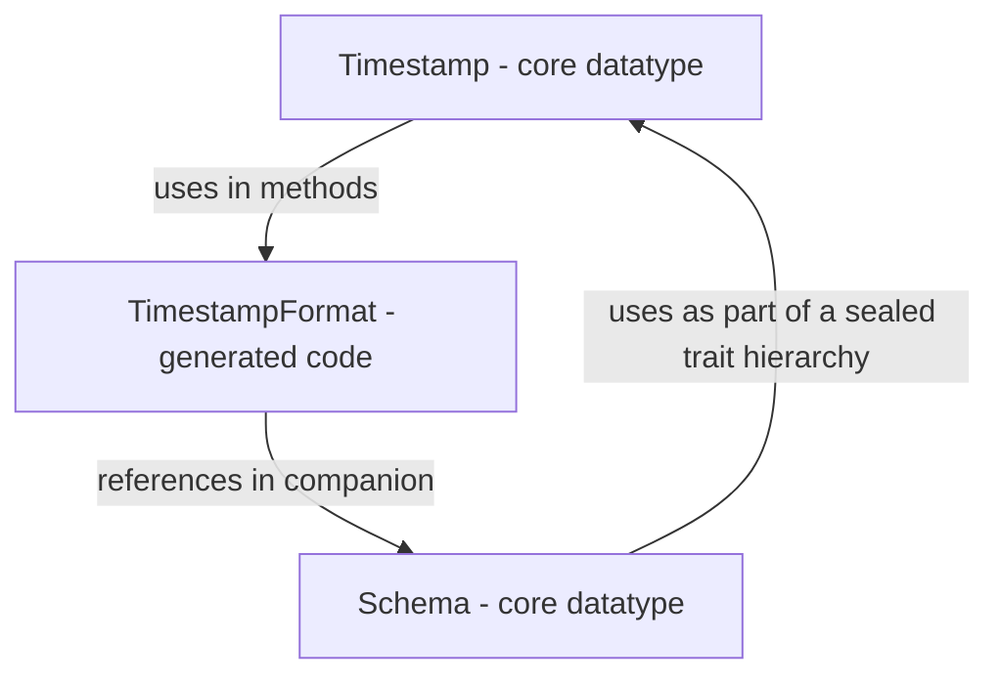
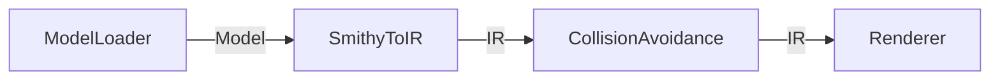

# Contributing

## Architecture

Before proceeding, it's recommended to get familiar with the library's [design](https://disneystreaming.github.io/smithy4s/docs/design/design).

### Module structure

Ths core modules of Smithy4s are:

- `protocol`: contains definitions for `smithy4s.meta` traits, which are special traits that influence how a user's code gets generated. Here, you'll find both the Smithy code that defines these traits,
  as well as Java code representing their typed representations (some of this code is [generated from the Smithy](https://github.com/polyvariant/smithy-trait-codegen-scala)).
  In this module, you'll also find the [Java validators](https://github.com/smithy-lang/smithy/blob/main/smithy-model/src/main/java/software/amazon/smithy/model/validation/Validator.java) for the meta traits, which are used by Smithy tools (such as the CLI, LSP and anything else that loads Smithy models) to verify that the traits are used correctly.
- `codegen`: defines and implements a programmatic interface for generating Scala code given a set of inputs (such as a list of Smithy files, dependencies, additional jars, and a target directory).
  This module is accompanied by `codegen-cli` (a command-line wrapper for this API) and `codegenPlugin`/`millCodegenPlugin` (the sbt/mill plugins, respectively).
- `core`: core data structures, generated code based on a few select "standard" Smithy namespaces.

A simplistic dependency graph of this setup looks like this:



In reality, `core` doesn't have a "normal" build-time dependency on `codegen`, and it doesn't use the standard sbt plugin for Smithy4s - we're "dogfooding", but due to sbt's design we invoke the codegen in an indirect way: through the `codegen-cli`'s main class.

### Core module

The core module generates some of its code, but it also contains core data types. These types refer to the generated code, and generated code refers to these types; it's a circular dependency - but it works. Here's an example:



In this module, you'll find:

- the core data structures used to implement interpreters (e.g. `Schema`, `Service` and their neighbors)
- the generated code for standard traits from Smithy and [Alloy](https://github.com/disneystreaming/alloy/) (e.g. `smithy.api.Http`, `alloy.SimpleRestJson`)
- high-level abstractions for working with the core structures (e.g. `SchemaVisitor`, `CachedSchemaCompiler`, `SchemaPartition`, `FunctorEndpointCompiler`)
- lower-level abstractions for implementing HTTP clients/servers (e.g. `UnaryServerEndpoint`, `UnaryServerCodecs`).

Note: the HTTP functionality may get moved to another module in the future.

### Code generation process

There are essentially three parts to how code generation works:

1. Load a Smithy model from the given inputs (Smithy files, jars, etc.)
2. Transform the model to an IR (Intermediate Representation) which is convenient to generate code from
3. Sanitize the names in the IR to avoid collisions with keywords, Scala prelude symbols, and ambiguous references.
4. Render the IR to strings representing the generated code.

The main places to look at for these are `ModelLoader`, `SmithyToIR`, `CollisionAvoidance` and `Renderer` respectively.



### IR

The `SmithyToIR` stage mostly has three jobs:

- transforming `smithy-model`'s datatypes to a form that's better suited being rendered as Scala code: Shapes, traits (hints), services, etc.
- analyzing relationships between shapes, such as: whether a shape is recursive, whether it's is a trait, or whether a member refers to a primitive (or a type alias)
- capturing information that can affect rendering (which `smithy4s.meta` traits are present, what information to later include in Scaladoc).

The conversion operates on the level of a single namespace to produce a "compilation unit".

### Renderer

In the renderer, we take the pre-processed Intermediate Representation and do the minimal amount of transformation to produce what's essentially strings - generated code.

For example, at this stage we already know which structures are mixins, which ones are recursive, and whether they should be generated in their own file or directly within a union (which is what the `smithy4s.meta#adt` / `adtMember` traits control).

We **do not** use [Scalameta](https://scalameta.org/) to render code. This is mostly due to a different philosophy: We pay a lot of attention to how readable the output is, and want Smithy4s-generated code to look like a human would write it, which means it needs to:

- be reasonably-formatted by default: we don't split lines by length, but by meaning.
  For example, a long trait value will usually be generated in a single line, so that it doesn't take up more vertical space than the datatype's fields.
- use imports instead of fully-qualified references, except when necessary.

Instead, we use a small DSL utilizing the `line` and `lines` string interpolators.

**Note:** `CollisionAvoidance` is a separate phase, but some further sanitization happens in `Renderer` itself, such as the handling of naming conflicts within the generated code (resolved by using fully-qualified references rather than imports).

## Feedback loop for codegen changes

When working on new features / bugfixes in the code generator, it's useful to see your changes reflected live
in real Scala files, and see what the compiler thinks about them.

This is one of the reasons we have the `bootstrapped` module: it contains code generated from the Smithy files in the `sampleSpecs` directory (as long as their namespaces are included in the module's `allowedNamespaces`).

These generated files are checked in (which means Git knows about them and you should commit all the changes that are made to them), and we have a build step that validates that **they are in sync with the codegen's output**.

You can run the codegen in a loop that watches your inputs and updates the bootstrapped files every time, with:

```bash
sbt ~bootstrapped/managedSources
```

Or just run the `bootstrapped/managedSources` task in sbt whenever you see fit. In order to compile these, replace `managedSources` with `compile`.

These generated files also exist so that you can use them in tests: `bootstrapped/test` will run these.

As a rule of thumb, if you're fixing a bug or adding a feature that can be seen in existing bootstrapped code (e.g. you're changing the rendering of Scaladoc in a big way), you don't need to add anything new to the Smithy inputs. You should, however, add a test in `RenderingSpec` to ensure your changes aren't overlooked later.

If the case you're handling needs new files to be showcased - add them first. This will give you an easy way to showcase how the code changes after you improve the codegen. Find a `sampleSpecs` file/namespace that fits your usecase, or create a new one.
